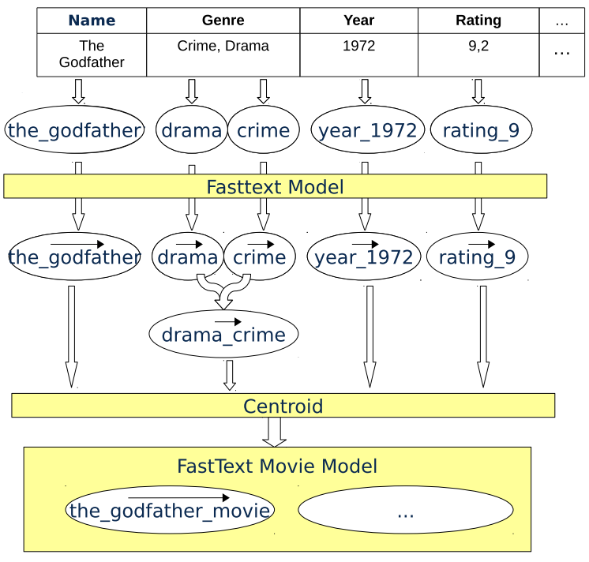

# postgres-cognitive-intelligence
This is implementation of cognitive intelligence with PostgresSQL.

## Installation

This project requires a installation of 2.7 and 3.5+

First you need to install all pip packages with:
`pip3 install -r requirements.txt`


## Procedure

#### Create Corpus
* Create an text representation the table
* Representing all rows of every table as one sentence
* Tokenize every string
* Tokenizing of strings: 
    * Replace spaces by underscores
    * All letter lower case
*Tokenizing of numbers
    * Represent by “columnName_number“
    * For example rating 9 is ”rating_9“
    * Alternative: replace by words
    * Alternative: buckets


#### Train FastText Model

#### Calculate Vector for each row
* Create vector space with every row as vector and row id as label



#### Example Query
* SQL Function „most_similar“
* most_similar(id, model_name, top_n)
 
##### Find most similar (kNN) movies to „The Godfather“

```sql
SELECT
  sim_id.similarity, movie.*
FROM movie qm, most_similar(qm.movie_id, 'movie_model', 4) AS sim_id
  JOIN ...
WHERE qm.name = 'The Godfather';
```


##### Result

| similarity| Name           | Genre | Year |Rating|…    |
| :-------: |:-------------: | :----:|:----:|:----:|:---: |
| 1         | The Godfather  | Crime, Drama | 1972|9.2|...
| 0.88      | The Godfather 2|Crime, Drama  |1973|9|...
| 0.88      | Scarface       |Crime, Drama |1983|8.3|...
| 0.76      | Good Fellas    |    Biography, Crime, Drama |1990|8.7|...|


```
@inproceedings{bordawekar2017using,
  title={Using Word Embedding to Enable Semantic Queries in Relational Databases},
  author={Bordawekar, Rajesh and Shmueli, Oded},
  booktitle={Proceedings of the 1st Workshop on Data Management for End-to-End Machine Learning},
  pages={5},
  year={2017},
  organization={ACM}
}
```